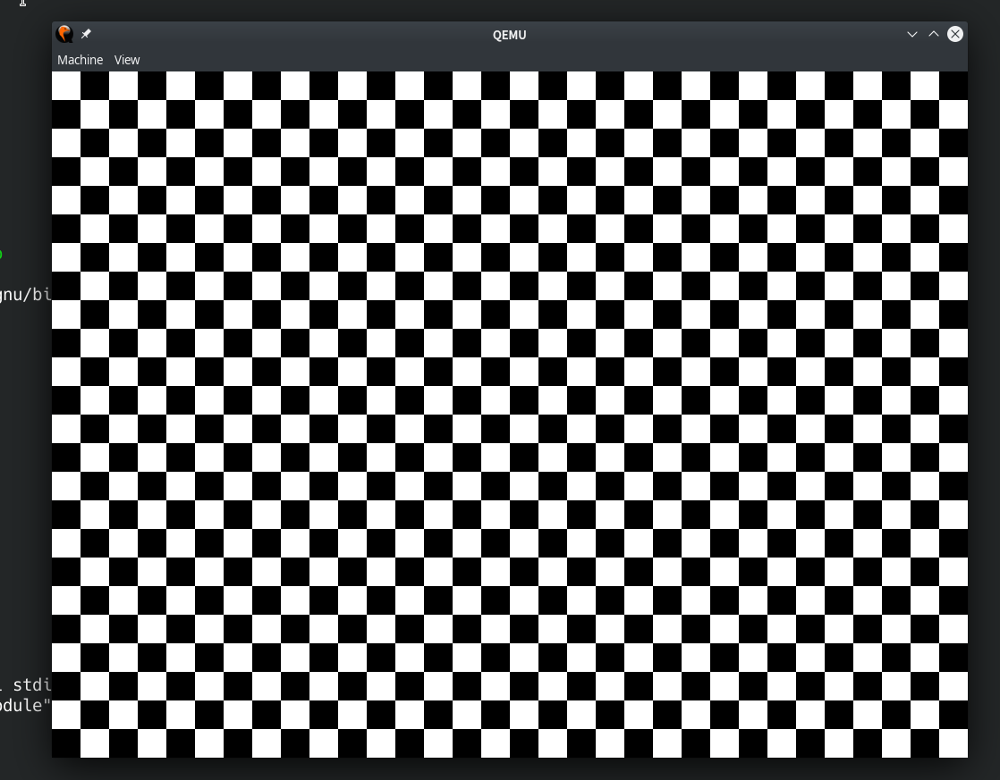
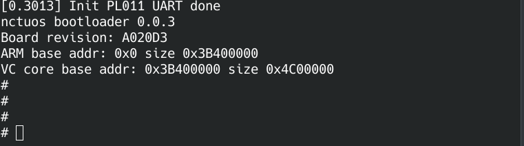

===================
Lab 2 : Bootloader
===================

Introduction
=============

You practiced bare metal programming in Lab 1.
Every time recompiling the kernel image, it's mandatory to copy it to the SD card and place it into rpi3.
This procedure is quite annoying.

A more convenient way to load the recompiled kernel without touching the SD card could be achieved by UART.

In this lab, you need to implement a bootloader that can load image kernel image by UART.
Besides, you'll learn how to communicate with GPU by mailbox.

Goal of this lab
================

* Understand and use mailbox to call functions from GPU.

* Implement a bootloader that can load kernel image by UART.

Mailbox
=========

ARM CPU is able to configure peripherals such as clock rate and framebuffer by calling VideoCoreIV(GPU) routines.
Mailboxes are the communication bridge between them.

You can refer to :ref:`mailbox` for more information.

Get the hardware's information
---------------------------------

Get the hardware's information is the easiest thing could be done by mailbox.
Check if you implement mailbox communication correctly by verifying the hardware information's correctness.

``required 1`` Get the hardware's information by mailbox and print them, you should at least print **board revision** and **VC Core base address**.

PL011 UART
----------

Mini UART's clock is based on system clock.
PL011 UART has it's own seperate clock.
You can get and set UART's clock rate by mailbox.
After that, you can set baud rate register according to UART's base clock rate.

``elective 1`` Get or set UART clock by mailbox and replace mini UART by PL011 UART.

Splash
------

During booting process, it's common to show some splash image to please user.
You can set GPU's framebuffer by mailbox to control your display output easily. 

``elective 2`` Set framebuffer by mailbox to show a splash image, show the result by qemu.

*Example splash image on qemu.*

Load kernel image
==================

Rpi3 boot flow
--------------

Rpi3's booting procedure could be roughly divided into 4 steps.

1. GPU executes the first stage bootloader from ROM on the SoC.

2. The first stage bootloader recognizes the FAT16/32 file system and loads the second stage bootloader bootcode.bin from SD card to L2 cache.

3. bootcode.bin initializes SDRAM and loads start.elf

4. start.elf initializes GPU's firmware and reads config.txt, cmdline.txt and kernel8.img to start OS.

Beside above SD card booting, rpi3 also provides several `boot modes <https://www.raspberrypi.org/documentation/hardware/raspberrypi/bootmodes/>`_.
You can also let rpi3's bootloader load another bootloader such as `u-boot <https://elinux.org/RPi_U-Boot>`_
as your **third stage bootloader** to load kernel in diverse ways.

``question 1`` In x86 machine, how the above 4 steps are implemented? Roughly describe it.

Your 3rd stage bootloader
--------------------------

Different from the previous stage bootloaders running on rpi3's GPU,
the 3rd stage bootloader is loaded by GPU and runs on rpi3's CPU.

You're going to implement your own 3rd stage bootloader.
To make it loadable by GPU, it should also be default **named as kernel8.img and loaded at 0x80000**.

Load by UART
^^^^^^^^^^^^^

Although UART is not a good way to transfer massive data, we still recommend you to load your kernel image by UART because

1. Your kernel image is not very big, UART is fast enough to load it in seconds.

2. It's easy to use and you've already implemented one.

3. Only one USB-TTL cable is needed for both communicating with host and loading kernel image.

UART rarely drops data if you implement your loader correctly.
So, you don't need a very complicate protocol during data transfer.
It's also fine to ask users to resend again if some error happens during loading.

``required 2`` Implement bootloader can load kernel image by UART.

``question 2`` Calculate how long will it take for loading a 10MB kernel image by UART if baud rate is 115200.

.. note::
  You might wondering how to test this functionality on QEMU.
  You can use ``qemu-system-aarch64 -serial pty`` (PL011 UART) or ``qemu-system-aarch64 -serial null -serial pty`` (Mini UART) to create a pseudo TTY device, and use screen to monitor it.

Load to certain address
^^^^^^^^^^^^^^^^^^^^^^^^^^

Sometimes, the kernel image should be loaded to a certain address.
You could provide an option for users to choose the loading address.

.. note:: 
  Kernel image's loading address might overlap your bootloader.
  Your code should be correct in this case.

``elective 3`` User can specify the kernel image's loading address.
