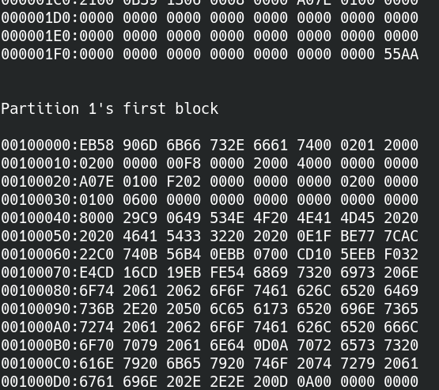

==================================
Lab 8 : File System Meets Hardware
==================================

*************
Introduction
*************

In the previous lab, the file system operations are only related to memory.
In this lab, you'll learn how a file system interacts with real devices.

**********************
Goals of this lab
**********************

* Understand how to read/write data from an SD card. 

* Implement a FAT32 file system.

* Understand how to access devices by VFS.

* Understand how memory be used as a cache for slow external storage mediums. 

************
Background
************

SD card 
===============

SD card driver
---------------

We provide an `SD controller driver
<https://github.com/GrassLab/osdi/raw/master/supplement/sdhost.c>`_
for you.

You should first call the ``sd_init()`` to set up GPIO, SD host, and initialize the SD card.
Then you can call the following APIs.

``readblock(int block_id, char buf[512])``

``writeblock(int block_id, char buf[512])``

It reads/writes 512 bytes from/to the SD card to/from buf[512].

.. note::
  You need to modify the MMIO base according to your kernel mapping.
  You can also modify the code to meet your requirements.

.. warning::
  The driver code is possibly wrong. 
  Also, it's only tested on QEMU and the rpi3 with the SD card we gave to you.
  Please report it if you encounter a problem, you can also get a bonus if you find the bug in the code.

SD card on QEMU
----------------

It's always easier to test your code on QEMU first.

You can add the argument ``-drive if=sd,file=,format=raw`` to attach an SD card file to QEMU. 

Sector vs. Block vs. Cluster
=============================

These terms appear in the documentation a lot,
you should be able to distinguish them.

Sector
-------

A sector is the smallest unit for a hard drive to manage its data.

The size is usually 512 bytes.

Block
------

A block is the smallest unit for a block device driver to read/write a device.
It's sometimes interchangeable with a sector.

The provided SD card driver code use 512 byte as the block size.

Cluster
---------

A cluster is composed of contiguous blocks.
A file system uses it as a basic unit to store a regular file or a directory.

FAT file system
================
FAT is a simple and widely used file system.
There is at least one file allocation table(FAT) whose entry stores the allocation status.
The entry's size can be varied from 12 bit(FAT12), 16 bit(FAT16), and 32 bit(FAT32).

.. note::
  You only need to implement FAT32 in this lab.

.. note::
  FAT is a portable file system and used in Windows, Linux, and some RTOS.
  Hence, your FAT driver should be able to read a file written by another operating system(e.g. Linux).
  Also, another operating system should be able to read a file written by your FAT driver.

Short filenames(SFN) vs. Long filenames(LFN)
--------------------------------------------
Originally, FAT uses 8 bytes to stores a file's name and 3 bytes to store the file's extension name.
For example, if the file's entire name is a.out, "a" will be stored in the 8-byte filename, "out" will be stored in the 3-byte extension name and "." is not stored.

However, it limits the filename's size, and it's impossible to store a filename with special characters.
Hence, LFN is invented.
It stores the filename in unicode and can stack multiple directory entries to support varied size filename.

SFN is easier than LFN, so you only need to support SFN in the required part.
The nctuos.img we provided in lab0 stores the filename in LFN.
We provide a new SFN `sfn_nctuos.img
<https://github.com/GrassLab/osdi/raw/master/supplement/sfn_nctuos.img>`_

There is also a kernel8.img inside.
The kernel8.img prints the first block and the first partition block of the SD card.
You can replace the kernel8.img with yours later on.

.. note::
  In Linux, you can specify how to mount a FAT file system. 

  ``mount -t msdos <device> <dir>``: linux store and load filename by SFN.

  ``mount -t vfat <device> <dir>``: linux store and load filename by LFN.

.. hint::
  In Linux, you can set up a loop device for a file.

  ``losetup -fP sfn_nctuos.img``: set up a loop device for sfn_nctuos.img.

  ``losetup -d <loop device>``: detach the loop device from the sfn_nctuos.img.

  Then, you can update the SD image to test your code on QEMU first.

Details of FAT
--------------

In this lab, you need to understand the format of FAT to be able to find, read, and write files in FAT.
The details are not covered by this documentation.
Please refer to https://en.wikipedia.org/wiki/Design_of_the_FAT_file_system
You can find everything about FAT there.

*********
Required
*********

In the required part, you should be able to read and write existing files under the root directory of a FAT32 file system.

You can create a new text file on your host computer first.
Then read/write the file on your rpi3.

The size of a FAT32 cluster is usually larger than the block size, but you can assume that the directory and the regular file you read/write is on the first block of the cluster.

Requirement 1
===============

In this requirement, you need to mount the FAT32 file system in the SD card.
You could set the FAT32 file system as the root file system if you didn't implement :ref:`mount` in lab7.

Get the FAT32 partition
---------------------------------

You should know the location of the FAT32 file system in the SD card first before mounting it.

The SD card should already be formatted by MBR.
You can parse it to get each partition's type, size, and block index.

.. hint::
  If you use the provided sfn_nctuos.img, the FAT32 partition's block index is 2048.

``required 1-1`` Get the FAT32 partition.

Set up a FAT32 mount
----------------------

A FAT32 file system stores its metadata in the first sector of the partition.

You need to do the following things during mounting.

1. Parse the metadata on the SD card.

2. Create a kernel object to store the metadata in memory.

3. Get the root directory cluster number and create a FAT32's root directory object.

``required 1-2`` Parse the FAT32's metadata and set up the mount.

Requirement 2
===============

Lookup and open a file in FAT32
--------------------------------
To look up a file in a FAT32 directory, 

1. Get the cluster of the directory and calculate its block index.

2. Read the first block of the cluster by the ``readblock()``

3. Traverse the directory entries and compare the component name with filename + extension name to find the file.

4. You can get the first cluster of the file in the directory entry.

``required 2-1`` Look up and open a file in FAT32.

Read/Write a file in FAT32
---------------------------

After you get the first cluster of the file, you can use ``readblock()``/``writeblock()`` to read/write the file.

``required 2-2`` Read/Write a file in FAT32.

.. note::
  You need to update the file's size in the FAT32's directly entry if the file's size is changed by a file write.

************
Elective
************

Create a file in FAT32
========================

To create a new file in FAT32,

1. Find an empty entry in the FAT table.

2. Find an empty directory entry in the target directory.

3. Set them to proper values.

``elective 1`` Create a file in FAT32.

FAT32 with LFN
===============
In the required part, the FAT32 filename is only supported for SFN.

In this part, please modify your code to support LFN.

Note that, the directory entry of LFN is stored in UCS-2. 
You need to translate the format if your terminal use UTF8 or other formats to print the result to your screen.

``elective 2`` Implement a FAT32 with LFN support. You should create/lookup a file with special characters(e.g. Chinese) in its name.

Device file
============

A vnode of a VFS tree can also represent a device, and we call it a device file.
To support a device file in a VFS, you need 

* a VFS API to create a device file's vnode,

* a mechanism that each device can register itself to a VFS.

Device file registration
-------------------------

A device can register itself to a VFS in its setup.
The VFS assigns the device a unique device id.
Then the device can be recognized by a VFS.

``elective 3-1`` Implement a mechanism that each device can register itself to a VFS.

mknod
------

A user can use the device id to create a vnode in a file system.
A file system uses the device id to find the device driver and assign the created vnode's file operations to the corresponding methods.

Finally, a user can read/write a device file by the methods provided by a device driver.

``elective 3-2`` Implement a VFS interface and a tmpfs method for ``int mknod(const char* pathname, int dev_id)``

sdcard
------
During the SD card driver's initialization,
the driver registers the SD card and all the partitions of the SD card to a VFS.

Then, a user can create device files for the SD card and its partitions by ``mknod()``.

After that, a user can open, read, and write the SD card by the device file.
A VFS will call the corresponding method and finally call the SD card driver's ``readblock()`` or ``writeblock()`` to read or write the SD card.

``elective 3-3`` Create a sdcard device file. A user can read or write an SD card by reading or writing its device file.

console
---------
The console of the operating system can also be implemented by a device file.
You can use your existing UART code and register it to a VFS.

After a UART vnode is created and is opened,
a file read or write will call the UART driver's read or write functions to get/print characters from/to the console.

``elective 3-4`` Create a UART device file as the console, A user can get/print characters from/to console by reading or writing its device file.

``question 1`` Explain how an OS supports automatically mounting file systems after plug in a USB flash drive into a computer.

Memory as a cache for external storage
=======================================

Accessing an SD card is much slower than accessing memory.
Before a CPU shutdown or an SD card ejected, it not necessary to synchronize the data between memory and SD card.
Hence, it's more efficient to preserve the data in memory and use memory as a cache for external storage.

We can categorize the file's data on the storage into three types: file's content, file's name, and file's metadata.

File's metadata
-----------------

Besides the content of a file, additional information such as file size is stored in external storage, too.
The additional information is the file's metadata.
There is also metadata for a file system such as FAT tables in FAT.

Those metadata are cached by a file system's kernel objects.
You should have already implemented it.

File's name
------------

A pathname lookup for a file system on external storage involves,

1. Read the directory block from the external storage.

2. Parse the directory entry and compare the directory entry's filename with the component name.

3. Get the next directory location.

A VFS can reduce the time spend on reading directory block and parsing directory entry by a component name cache mechanism.
A component name cache mechanism can be implemented as:

1. Look up the component name cache of the directory first.

2. If successfully finds the vnode, return to the vnode. Otherwise, call the lookup method of the underlying file system.

3. The underlying file system looks up from external storage.

4. If it successfully finds the file, it creates a vnode for the file and put it into the component name cache.

``elective 4-1`` Implement a component name cache mechanism for faster pathname lookup.

``question 2`` How to implement a component cache mechanism if a file has multiple names (because of hard links)

File's content
-----------------

A VFS can cache a file's content in memory by page frames.
A page cache mechanism can be implemented as:

1. Check the existence of the file's page frames when read or write a file.

2. If the page frames don't exist, allocate page frames for the file. 

3. The underlying file system populates the page frames with the file's content in external storage if necessary.

4. Read or write the page frames of the file.

``elective 4-2`` Implement a page cache mechanism for faster file read and write.

sync
------

A VFS should synchronize the file's memory cache with the external storage when a user wants to eject it.
Hence, a VFS should provide an API for users to synchronize the data, and the file system should implement the synchronize method for writing data back to the external storage.

``elective 4-3`` Implement a VFS interface and a FAT32 method for ``int sync()``

``question 3`` Does tmpfs need sync method?
